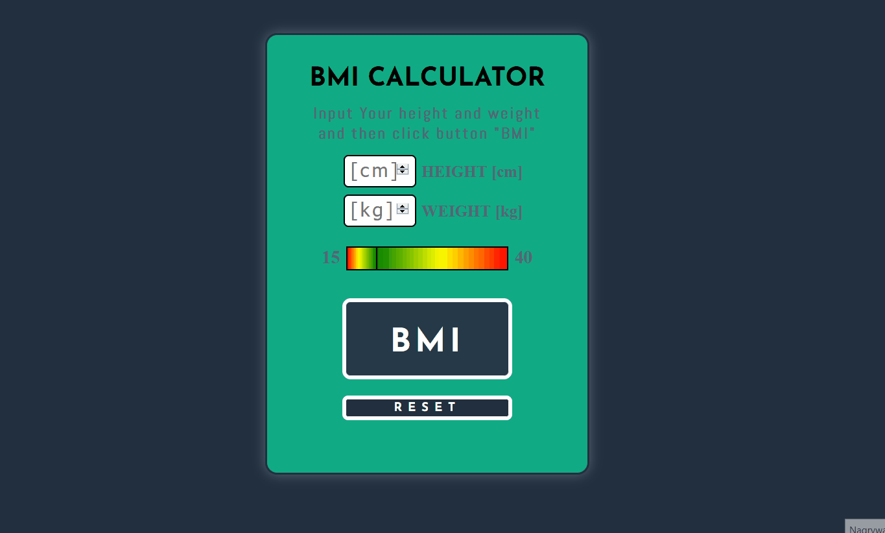

# BMI CALCULATOR

BMI Calculator is simple aplication to calculate Your BMI index. It's my first project which I will prepare for train my skills in basic html, scss and Vanilla JS. This project was prepared without any framework. For styling I used pure scss styling. Structure of the project is very simple: index.html file with HTML code, style.scss file with styles and script.js file with all js code.

## How it works

## Link
https://webster2020.github.io/BMI_CALCULATOR/

## Getting Started
1. git clone git@github.com:Webster2020/BMI_CALCULATOR.git
2. npm install
3. npm run watch - run the project and than You can see it on Your device

*...or use link if You only want to check how it works

Used technologies:
 1. Vanilla js without any framework with ES6+ standard
 2. Scss for styling
 3. HTML5 for content

Implemented solutions

 1. Content of aplication is putted in one container
 2. Styles are divided into several parts:
  - global
  - description
  - inputs
  - buttons
  - output
  - proposal
  - @media
 3. JS code is divided to several functions and constants
 4. BMI Button functionality:
  - calculate BMI index
  - change color after calculation
  - change proposal text
  - shadow efect with mouse events
  - set position of pointer on diagram
  - set proposal text 
 5. Inputs functionality:
  - change color of BMI button dynamically with changing value of input
  - change proposal text dynamically with changing value of input
  - set dynamically position of pointer on diagram
 6. Reset Button functionality:
  - shadow efect with mouse events
  - clear inputs
  - clear color of BMI Button
  - reset diagram to default position
  - reset proposal text to default value

### Project architecture

Project is not diveded on component (like in e.g. React), because of its size structure is very simple:
 1. html - content of aplication
 2. scss - all styles
 3. js - all functions and all logic for aplication
 4. root file: index.html
 5. configuration files: gitignore, package.json etc.

### How did I create this project?

Project was prepared based on my own idea.

## Plan for future dvelopment

 - Handling the situation when user input incorrect value of weight or height (e.g.: value belowe 0 or not a number)...
 - Refactoring code

## Authors

* **Michal Szwajgier** - *Webster2020* - 

## License
Free licence
